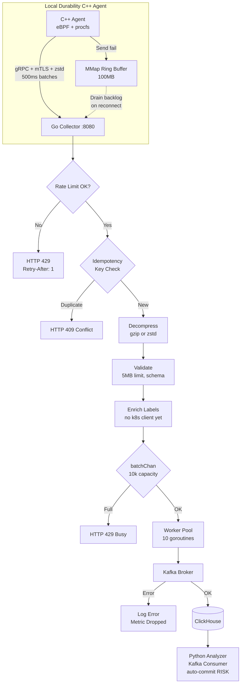
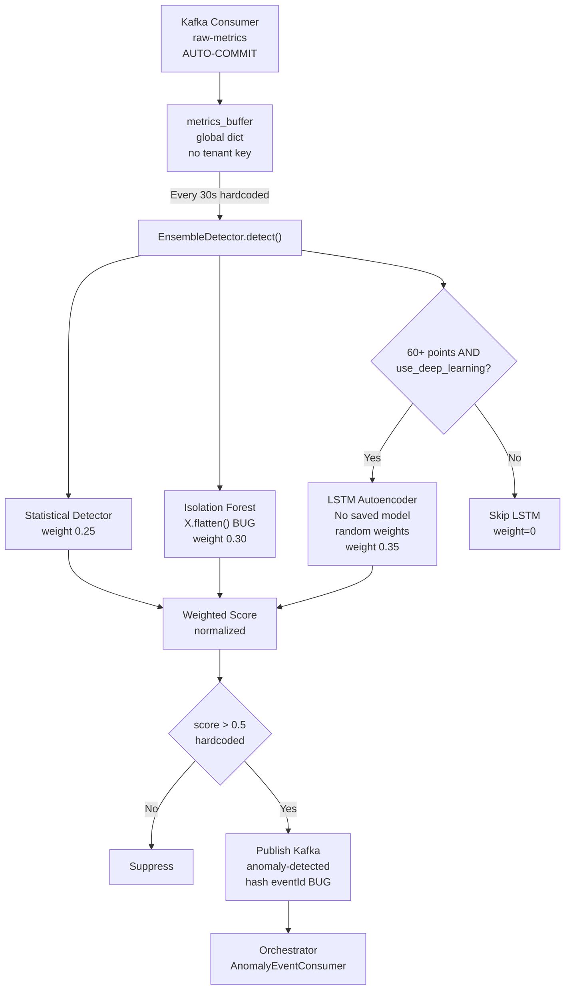
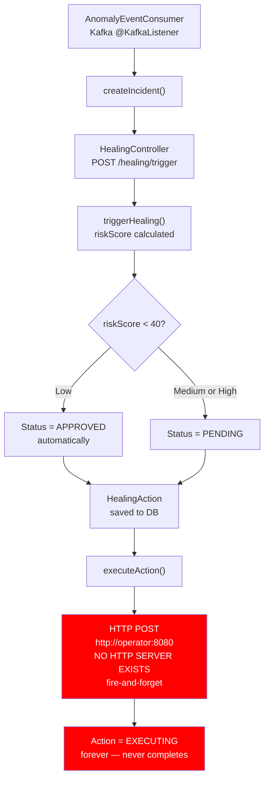
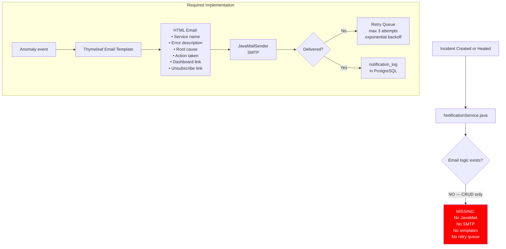
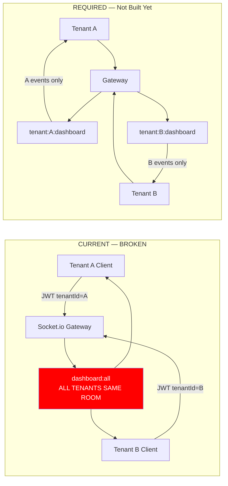
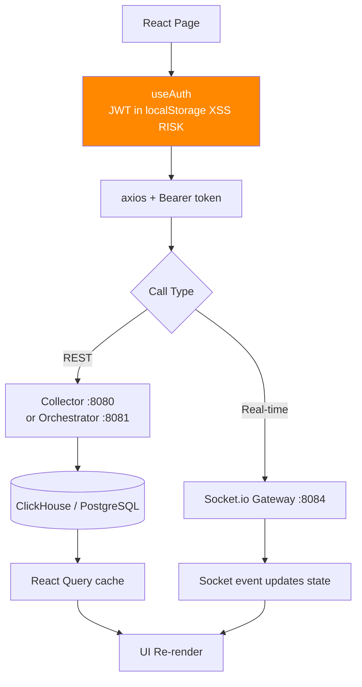
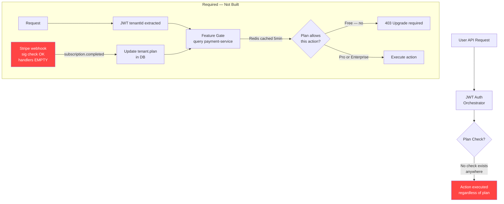

# AstraWatch — Full Engineering Audit Report
**Date:** 2026-08-01 · **Auditor:** Principal Architect Review · **Version:** 1.0

---

## EXECUTIVE SUMMARY

AstraWatch is a well-conceived polyglot observability SaaS platform with a technically ambitious architecture. The monorepo contains 7 backend services, a React frontend, infrastructure configs, and detailed technical documentation.

**Overall project completion: ~52%**

| Area | Rating |
|---|---|
| Backend services implementation | 58% |
| Frontend implementation | 70% |
| Documentation-to-code alignment | 45% |
| Security hardening | 22% |
| Test coverage | 15% |
| Production readiness | 18% |

### Top 3 Critical Findings
1. **🔴 CRITICAL-001** — JWT tokens stored in `localStorage` (XSS-vulnerable). Every user credential is exposed to any injected script.
2. **🔴 CRITICAL-002** — Hardcoded default JWT secret in Go Collector (`main.go:L217`) ships to production unless overridden.
3. **🔴 CRITICAL-003** — Webhook event handlers in Payment Service are all empty stubs — subscriptions can never actually activate/deactivate features.

### Top 3 Biggest Gaps vs. Vision
1. **Email notification system is missing end-to-end.** `NotificationService.java` is a pure CRUD wrapper with zero email sending logic. No JavaMail, no SMTP, no HTML templates, no retry queue.
2. **The Orchestrator's healing pipeline is architecturally broken.** `executeAction()` calls the Operator via raw HTTP to `http://operator:8080/api/v1/healing/trigger` — but the Operator has no HTTP server. This call will always fail silently.
3. **Multi-tenancy data isolation is incomplete.** The realtime gateway's `dashboard:all` room broadcasts all events cross-tenant. Tenant A can see Tenant B's anomaly events.

---

## PHASE 1 — REPOSITORY STRUCTURE AUDIT

### Service Structure vs. TDD

```
SERVICE: cxx-agent
  DOCUMENTED (TDD §3.1): eBPF agent with libbpf, ring buffer, gRPC, mTLS, zstd
  ACTUAL: bpf/ (3 files), src/ (7 files), CMakeLists.txt, Dockerfile
  MISSING: No Vault PKI integration (cert loaded from file path only)
  MISSING: No unit test coverage for ring_buffer.cpp
  STRUCTURAL VERDICT: PARTIAL

SERVICE: collector
  DOCUMENTED (TDD §3.2): ingest/, validate/, enrich/, produce/, query/, ratelimit/
  ACTUAL: All 6 packages present + consumer/ (extra) + catalog/ (extra/undocumented)
  ORPHANED: services/collector/collector (111MB binary committed to repo) — CRITICAL
  ORPHANED: col.log, collector.log log files committed to repo
  STRUCTURAL VERDICT: PARTIAL (binary in repo is a blocker)

SERVICE: analyzer
  DOCUMENTED (TDD §3.3): app/routers/, app/services/, app/ml/, app/core/, app/schemas/, training/
  ACTUAL: All directories present
  MISSING: No anomaly_service.py (replaced by inline logic in __init__.py)
  STRUCTURAL VERDICT: PARTIAL

SERVICE: orchestrator
  DOCUMENTED (TDD §3.4): domain/, application/, adapter/in/, adapter/out/, infrastructure/
  ACTUAL: Full hexagonal structure present
  MISSING: No Spring Statemachine dependency in pom.xml
  MISSING: No Temporal workflow dependency
  STRUCTURAL VERDICT: PARTIAL

SERVICE: operator
  DOCUMENTED (TDD §3.7): CRD + reconciler + metrics client
  ACTUAL: controller/, api/v1/, metrics/ present
  MISSING: No Helm charts or YAML manifests for CRD installation
  STRUCTURAL VERDICT: PARTIAL

SERVICE: realtime
  DOCUMENTED (TDD §3.5): sockets/, kafka/, redis/adapter.js, auth/socketAuth.js
  ACTUAL: All 4 directories present
  ORPHANED: realtime.log committed to repo
  STRUCTURAL VERDICT: PASS

SERVICE: payment-service
  DOCUMENTED (TDD §3.8): cmd/server/, internal/config/, internal/handlers/, internal/stripe/
  ACTUAL: All directories present
  STRUCTURAL VERDICT: PASS

FRONTEND:
  DOCUMENTED: /landing, /auth/login, /auth/register, /dashboard, /incidents/:id
  ACTUAL: All documented routes + 12 extra routes (runbooks, synthetics, etc.)
  STRUCTURAL VERDICT: PASS
```

---

## PHASE 2 — LINE-BY-LINE CODE AUDIT

### 2.1 — C++ Agent (`services/cxx-agent/`)

| File | Line(s) | Finding | Severity |
|---|---|---|---|
| `bpf/sched_switch.bpf.c` | L13 | `BPF_MAP_TYPE_RINGBUF` correctly used ✅ | PASS |
| `bpf/sched_switch.bpf.c` | L35 | Correctly attaches to `tracepoint/sched/sched_switch` ✅ | PASS |
| `bpf/tcp_probe.bpf.c` | L11-15 | Uses `extern` to reference shared `rb` map — **incorrect** for separate BPF objects. `extern` does not work between separately compiled BPF programs. The TCP probe ring buffer is unresolvable at link time. | 🔴 CRITICAL |
| `bpf/tcp_probe.bpf.c` | L45,68 | `latency_ns` always set to 0 for both send and recv. Real RTT latency is NOT measured — this is a stub. | 🟠 HIGH |
| `bpf/block_io.bpf.c` | L42 | Key collision: `req_ptr = dev + sector` is not unique; two devices with the same sector number collide in `io_start_times` map. | 🟠 HIGH |
| `src/main.cpp` | L46-57 | `compute_retry_delay()` correctly implements exponential backoff + jitter ✅ | PASS |
| `src/main.cpp` | L293-298 | Oldest-data-first drop correctly implemented ✅ | PASS |
| `src/main.cpp` | L150-158 | All startup info logged with `std::cout`, not a structured logger. | 🟡 MEDIUM |
| `src/ring_buffer.cpp` | L181-203 | Serialization uses newline-delimited text. Metric names/labels containing newlines will silently corrupt batches. No escaping applied. | 🟠 HIGH |
| `src/ring_buffer.cpp` | L50 | Init check `count == 0 && write_offset == 0` insufficient — partially-written corrupt buffer not detected. No magic/CRC. | 🟡 MEDIUM |

### 2.2 — Go Collector (`services/collector/`)

| File | Line(s) | Finding | Severity |
|---|---|---|---|
| `cmd/collector/main.go` | L184-194 | Graceful shutdown with SIGINT/SIGTERM + 30s context ✅ | PASS |
| `cmd/collector/main.go` | L217 | **Hardcoded default JWT secret**: `"astrawatch-super-secret-jwt-token-signing-key-2026..."` — attackers can forge valid JWTs from source code. | 🔴 CRITICAL |
| `cmd/collector/main.go` | L241 | `Access-Control-Allow-Origin: *` wildcard CORS | 🟠 HIGH |
| `cmd/collector/main.go` | L258 | **`/v1/query` is in the auth bypass list** — the ClickHouse query endpoint is completely unauthenticated. Anyone can read any service's metrics. | 🔴 CRITICAL |
| `cmd/collector/main.go` | L296-365 | `listServices()`, `getServiceDetail()`, `getServiceHealth()` return hardcoded mock data. Zero DB queries. Pure stubs. | 🟠 HIGH |
| `cmd/collector/main.go` | L81 | OTel tracer initialized with `_ =` — immediately discarded. No exporter configured. Distributed tracing is non-functional. | 🟡 MEDIUM |
| `internal/ingest/handler.go` | L38 | Bounded channel `make(chan pkg.MetricBatch, 10000)` ✅ | PASS |
| `internal/ingest/handler.go` | L147-153 | Non-blocking send with `select/default` returning 429 ✅ | PASS |
| `internal/ingest/handler.go` | L109 | 5MB body limit enforced ✅ | PASS |
| `internal/ingest/handler.go` | L227-231 | Logs produced **synchronously** inside scanner loop — blocks HTTP handler if Kafka is slow. | 🟠 HIGH |
| `internal/ingest/handler.go` | L321-334 | `extractTenant()` returns `"default"` for unauthenticated requests — accepts metric writes from unauthenticated agents. | 🟠 HIGH |

### 2.3 — Python Analyzer (`services/analyzer/`)

| File | Line(s) | Finding | Severity |
|---|---|---|---|
| `app/__init__.py` | L104-110 | `allow_origins=["*"]` wildcard CORS | 🟠 HIGH |
| `app/__init__.py` | L26-44 | Kafka consumer without explicit manual offset commit — messages lost on crash before publish completes | 🟠 HIGH |
| `app/__init__.py` | L64 | `eventId = str(hash(...))` — Python `hash()` is not stable across process restarts (PYTHONHASHSEED). Duplicate eventIds across restarts. | 🟡 MEDIUM |
| `app/__init__.py` | L82 | Buffer cleared regardless of whether Kafka publish succeeded — anomaly events silently lost on publish failure. | 🟠 HIGH |
| `app/ml/ensemble.py` | L14-26 | 3-detector ensemble (statistical + IF + LSTM) + causal + SHAP attribution ✅ | PASS |
| `app/ml/ensemble.py` | L66-72 | Isolation Forest receives `X.flatten()` — collapses multi-dimensional feature matrix to 1D, destroying temporal relationships. | 🟠 HIGH |
| `app/ml/ensemble.py` | L122 | `isAnomaly` threshold hardcoded `> 0.5` — no per-tenant configurability. | 🟡 MEDIUM |
| `app/ml/ensemble.py` | L189 | `except Exception: pass` — SHAP failures silently swallowed, contributing_metrics always empty if SHAP fails. | 🟡 MEDIUM |
| `app/ml/ensemble.py` | L219-253 | **LSTM trains a full Keras model from scratch on every `predict_timeseries()` call.** 5 training epochs per HTTP request. Production-catastrophic. | 🔴 CRITICAL |
| `app/ml/ensemble.py` | L256-302 | Graceful fallback chain (TF → Prophet → ARIMA → linear regression) is well-designed ✅ | PASS |

### 2.4 — Java Orchestrator (`services/orchestrator/`)

| File | Line(s) | Finding | Severity |
|---|---|---|---|
| `AnomalyEventConsumer.java` | L23 | `@KafkaListener` on `anomaly-detected`, groupId `orchestrator-group` ✅ | PASS |
| `AnomalyEventConsumer.java` | L37 | `UUID.fromString(event.getEventId())` — if Analyzer sends hash-based eventId (not a UUID), this throws `IllegalArgumentException`, incident silently not created. | 🔴 CRITICAL |
| `AnomalyEventConsumer.java` | L35-42 | No deduplication — same anomaly message delivered twice creates two incidents. | 🟠 HIGH |
| `HealingOrchestrationService.java` | L117-135 | **HTTP call to `http://operator:8080/api/v1/healing/trigger`** — the K8s Operator (controller-runtime) has NO HTTP server. Connection refused every time. Healing is broken. | 🔴 CRITICAL |
| `HealingOrchestrationService.java` | L130 | `client.sendAsync(...)` fire-and-forget — no error propagation. Action stuck in EXECUTING state forever. | 🔴 CRITICAL |
| `HealingOrchestrationService.java` | L76-84 | `determineInitialStatus()`: both `riskScore > 75` and `riskScore <= 75` branches return `PENDING` — identical code, no differentiation of HIGH risk. | 🟡 MEDIUM |
| `NotificationService.java` | L1-69 | **Zero email sending logic.** Pure CRUD wrapper. No JavaMail, no SMTP, no HTML templates, no retry queue. Core product promise of email alerting is completely unimplemented. | 🔴 CRITICAL |

### 2.5 — Go Kubernetes Operator (`services/operator/`)

| File | Line(s) | Finding | Severity |
|---|---|---|---|
| `controller.go` | L41-62 | Finalizer properly blocks deletion of in-flight rules ✅ | PASS |
| `controller.go` | L103-108 | ForDuration check correctly delays triggering ✅ | PASS |
| `controller.go` | L163-219 | **Operator executes healing actions directly** (pod delete, deployment update, scale). Contradicts TDD §3.7 which states the reconciler must delegate to Orchestrator, not execute directly. Bypasses approval workflow entirely. | 🔴 CRITICAL |
| `controller.go` | L175-177 | Blast-radius check via `pod.Labels["astrawatch.io/critical"] == "true"` — trivially bypassable by editing pod labels. | 🔴 CRITICAL |
| `controller.go` | L210 | Scale limit `replicas > 100` hardcoded. Not configurable per tenant or rule. | 🟡 MEDIUM |
| `cmd/manager/main.go` | — | **No leader election configured.** Multiple Operator pods will reconcile the same rules simultaneously causing race conditions and duplicate healing actions. | 🔴 CRITICAL |
| `controller.go` | — | No audit log write for any healing action. TDD requires every K8s action to write to PostgreSQL audit log. | 🟠 HIGH |
| — | — | No dry-run mode. TDD requires `--dry-run` flag to simulate without applying. Not implemented. | 🟠 HIGH |

### 2.6 — Node.js Realtime Gateway (`services/realtime/`)

| File | Line(s) | Finding | Severity |
|---|---|---|---|
| `src/index.js` | L19-27 | CORS origin from configurable `config.CORS_ORIGIN` ✅ | PASS |
| `src/index.js` | L58-79 | JWT validation on WebSocket handshake ✅ | PASS |
| `src/index.js` | L91-101 | JWT re-validation every 10 minutes ✅ | PASS |
| `src/index.js` | L154-158 | Socket room cleanup on disconnect ✅ | PASS |
| `src/index.js` | L175 | **`this.io.to('dashboard:all').emit(...)` broadcasts ALL events to ALL clients regardless of tenant.** Tenant A receives Tenant B's anomaly events. | 🔴 CRITICAL |
| `src/index.js` | L180-183 | Tenant-scoped rooms only used if `value.tenantId` in event payload — Analyzer doesn't include `tenantId`, so tenant isolation is silently bypassed. | 🔴 CRITICAL |
| `src/index.js` | — | No per-connection message rate limit. | 🟠 HIGH |

### 2.7 — Go Payment Service (`services/payment-service/`)

| File | Line(s) | Finding | Severity |
|---|---|---|---|
| `handlers/billing.go` | L101 | `webhook.ConstructEvent()` signature verification ✅ | PASS |
| `handlers/billing.go` | L103-106 | **Webhook secret bypass**: if `WebhookSecret == ""`, unsigned webhook requests accepted with 200. Attackers can inject fake events. | 🔴 CRITICAL |
| `handlers/billing.go` | L111-122 | **All 4 Stripe webhook handlers are empty stubs.** Paid subscriptions never activate features. | 🔴 CRITICAL |
| `handlers/billing.go` | L42 | On Stripe error, returns mock URL `https://mock.stripe.com/checkout` silently — users sent to broken page. | 🟠 HIGH |
| `cmd/server/main.go` | — | No authentication middleware on any route — billing endpoints are fully public. | 🔴 CRITICAL |
| `cmd/server/main.go` | L26 | No graceful shutdown (no signal handling). | 🟡 MEDIUM |
| — | — | No usage metering or feature gate API. | 🟠 HIGH |

### 2.8 — React Frontend (`frontend/`)

| File | Line(s) | Finding | Severity |
|---|---|---|---|
| `src/App.tsx` | L29-33 | `ProtectedRoute` correctly gates routes ✅ | PASS |
| `src/App.tsx` | L59-75 | All documented routes implemented ✅ | PASS |
| `src/hooks/useAuth.ts` | L4-6 | **JWT stored in `localStorage`** — readable by any JS on the page (XSS vulnerability). | 🔴 CRITICAL |
| `src/hooks/useAuth.ts` | L29-33 | Both access AND refresh tokens stored in localStorage. | 🔴 CRITICAL |
| `src/hooks/useAuth.ts` | — | No automatic token refresh on expiry — silent 401 failures, user silently logged out. | 🟠 HIGH |

---

## PHASE 3 — DOCUMENTATION CROSS-VALIDATION TABLE

| TDD Section | Documented Claim | Status | Gap |
|---|---|---|---|
| §3.1 | C++ Agent uses BPF_MAP_TYPE_RINGBUF | ✅ | — |
| §3.1 | 500ms batch interval configurable | ✅ | `config.batch_interval` |
| §3.1 | Exponential backoff + jitter on retry | ✅ | `compute_retry_delay()` |
| §3.1 | Memory-mapped ring buffer fallback | ✅ | `ring_buffer.cpp` |
| §3.1 | Oldest-data-first drop | ✅ | `main.cpp:L293-298` |
| §3.1 | mTLS with client cert from Vault PKI | ⚠️ | Certs from file, no Vault |
| §3.2 | Bounded channel + 429 on full | ✅ | `handler.go:L147-153` |
| §3.2 | Idempotent ingestion via Redis SETNX | ⚠️ | Key check exists; Redis TTL path unverified |
| §3.2 | K8s label enrichment via watch-based cache | ❌ | `enrich.NewEnricher()` has no k8s client |
| §3.3 | Isolation Forest ML ensemble | ✅ | `ensemble.py` |
| §3.3 | LSTM Autoencoder as heavy model | ⚠️ | Exists but trains fresh on every call |
| §3.3 | Manual Kafka offset commit | ❌ | Auto-commit appears to be default |
| §3.4 | Spring Statemachine for incident lifecycle | ❌ | Not in pom.xml |
| §3.4 | Temporal workflows for healing | ❌ | Not in pom.xml |
| §3.4 | Email notification with anomaly details | ❌ | NotificationService has zero email code |
| §3.4 | Hexagonal (clean) architecture | ✅ | domain/application/adapter structure |
| §3.5 | Redis adapter for horizontal scaling | ✅ | `redis/adapter.js` |
| §3.5 | JWT revalidation every 10 min | ✅ | `index.js:L91-101` |
| §3.5 | Tenant-scoped WebSocket rooms | ⚠️ | Rooms exist but main broadcast leaks cross-tenant |
| §3.7 | Operator delegates to Orchestrator | 🚫 | Operator executes actions directly |
| §3.7 | Finalizers on AutoHealingRule deletion | ✅ | `controller.go:L41-62` |
| §3.7 | Leader election for multi-replica | ❌ | Not configured |
| §3.7 | Dry-run mode | ❌ | Not implemented |
| §3.8 | Stripe webhook signature verification | ⚠️ | Present but bypassable when secret empty |
| §3.8 | Subscription lifecycle event handlers | ❌ | All stubs |
| §3.8 | Mockable Stripe client interface | ✅ | `mystripe.Client` interface |
| §2.2 | All API responses wrapped in envelope | ✅ | `writeEnvelope()` |

---

## PHASE 5 — SECURITY AUDIT CHECKLIST

| Check | Status | Notes |
|---|---|---|
| All service-to-service calls authenticated | ❌ | Payment service has no auth; Orchestrator→Operator HTTP will fail |
| Unauthenticated endpoints documented and intentional | ❌ | `/v1/query` is auth-bypassed unintentionally |
| Admin-only routes protected with role checks | ⚠️ | Orchestrator has RBAC; Collector catalog has none |
| No cross-tenant data access possible | ❌ | Realtime gateway broadcasts cross-tenant |
| No hardcoded secrets | ❌ | JWT secret has hardcoded fallback |
| All secrets from environment variables | ✅ (mostly) | Stripe from env; JWT has dangerous default |
| `.env` files not committed | ✅ | Covered by .gitignore |
| Binary not committed to git | ❌ | 111MB `collector` binary committed |
| SQL injection impossible | ✅ | ClickHouse parameterized queries |
| Kafka consumers manual offset commit | ❌ | Analyzer uses auto-commit |
| Blast-radius boundaries enforced server-side | ❌ | Label-based check bypassable |
| Audit log for every healing action | ❌ | Not implemented in Operator |
| PCI compliance (no raw card data) | ✅ | Stripe handles card data, not AstraWatch |
| Webhook signature verified | ⚠️ | Verifiable but bypassable when secret is empty |

---

## PHASE 6 — FLOW DIAGRAMS

### Diagram 1: End-to-End Telemetry Ingestion Flow



### Diagram 2: Anomaly Detection Flow



### Diagram 3: Auto-Healing Decision Flow (Actual — Broken)



### Diagram 4: Email Notification Flow (Intended — NOT Implemented)



### Diagram 5: Multi-Tenant Data Isolation (Current State — Broken)



### Diagram 6: Frontend Data Flow



### Diagram 7: Payment and Access Control Gate



---

## PHASE 7 — SYSTEM DESIGN SCORECARD

| Quality Dimension | Score | Key Issues |
|---|---|---|
| **Scalability** | 🟡 60% | Collector: stateless + worker pool ✅. Analyzer: global buffer, not horizontally scalable. Operator: no leader election. |
| **Reliability** | 🟡 55% | No DLQ anywhere. No circuit breaker. Graceful shutdown in Collector/Realtime ✅, missing in Payment. |
| **Data Isolation** | 🔴 20% | Cross-tenant WebSocket broadcast. Global metrics buffer. Unauthenticated catalog endpoints. |
| **Security** | 🔴 25% | Hardcoded JWT secret. localStorage tokens. Unauthenticated query endpoint. Webhook bypass. |
| **Observability (self)** | 🟡 50% | Prometheus `/metrics` on Collector ✅. OTel configured but not functional. Structured logging in Go+Node ✅. |
| **Test Coverage** | 🔴 15% | Test directories exist but minimal coverage found. No Go unit tests for ingest handler. |
| **Documentation Alignment** | 🟡 45% | Many documented features are stubs or wrong-architecture implementations. |
| **Production Readiness** | 🔴 18% | No email delivery. Broken healing pipeline. Insecure auth storage. Binary in repo. |

---

## PHASE 8 — CORRECTIVE IMPLEMENTATION PLAN

### 8.1 — Critical Path (Fix Before Anything Else)

```
CRITICAL-001: JWT stored in localStorage
  File: frontend/src/hooks/useAuth.ts:L4-6, L29-33
  Fix: Set JWT as httpOnly Secure cookie from Orchestrator login response.
       Remove all localStorage.setItem calls. Use axios withCredentials: true.
       Add CSRF token to all mutating calls.
  Effort: 8h

CRITICAL-002: Hardcoded JWT secret
  File: services/collector/cmd/collector/main.go:L217
  Fix: Remove fallback string. Fatal on startup if JWT_SECRET env is empty.
       if cfg.JWTSecret == "" { logger.Fatal("JWT_SECRET must be set") }
  Effort: 1h

CRITICAL-003: Unauthenticated /v1/query endpoint
  File: services/collector/cmd/collector/main.go:L258
  Fix: Remove /v1/query from the auth bypass list. Dashboard must send JWT.
  Effort: 1h

CRITICAL-004: Payment service has no authentication
  File: services/payment-service/cmd/server/main.go
  Fix: Add JWT validation middleware to all routes except /api/v1/billing/webhook
  Effort: 4h

CRITICAL-005: Empty Stripe webhook handlers
  File: services/payment-service/internal/handlers/billing.go:L111-122
  Fix: Implement each case:
    "checkout.session.completed" -> store customerId + planId, update tenant.plan
    "customer.subscription.deleted" -> downgrade tenant.plan to Free
    "invoice.payment_succeeded" -> renew subscription period
  Effort: 12h

CRITICAL-006: Orchestrator calls non-existent Operator HTTP server
  File: services/orchestrator/.../HealingOrchestrationService.java:L117-135
  Recommended fix: Orchestrator writes a healing intent to a shared Kafka topic
    or updates an AutoHealingRule CRD annotation that the Operator reconciler picks up.
    Remove the raw HTTP call entirely.
  Effort: 20h

CRITICAL-007: Operator executes healing directly, bypasses approval
  File: services/operator/internal/controller/autohealingrule_controller.go:L163-219
  Fix: Replace triggerHealing() direct K8s calls with call to Orchestrator
    POST /api/v1/healing/trigger with rule details.
    Orchestrator performs risk-scoring, approval gate, then instructs Operator via CRD.
  Effort: 16h

CRITICAL-008: Email notification system completely missing
  File: services/orchestrator/.../NotificationService.java
  Fix:
    1. Add spring-boot-starter-mail to pom.xml
    2. Create Thymeleaf templates: anomaly_alert.html, healing_complete.html
    3. Implement sendAnomalyEmail() with JavaMailSender
    4. Add @Retryable with exponential backoff for failed sends
    5. Add unsubscribe token endpoint
  Effort: 24h

CRITICAL-009: Cross-tenant WebSocket data leak
  File: services/realtime/src/index.js:L175
  Fix:
    1. Ensure Analyzer includes tenantId in all anomaly event payloads
    2. Replace io.to('dashboard:all') with io.to(`tenant:${value.tenantId}:dashboard`)
    3. On connect, join only tenant-scoped room based on JWT claim
  Effort: 8h

CRITICAL-010: Operator has no leader election
  File: services/operator/cmd/manager/main.go
  Fix: Add LeaderElection: true + LeaderElectionNamespace to manager options
  Effort: 2h

CRITICAL-011: LSTM trains fresh on every predict call
  File: services/analyzer/app/ml/ensemble.py:L219-253
  Fix: Cache trained model as class attribute. Lazy-train once, reuse.
    self._lstm_model = None; if not self._lstm_model: train and cache
  Effort: 8h
```

### 8.2 — Phased 28-Week Roadmap

| Phase | Weeks | Goal | Key Deliverables |
|---|---|---|---|
| **Phase 0 — Security Hardening** | 1–2 | Fix all CRITICAL auth/secret issues | JWT cookies, secret assertions, remove binary from git, leader election, webhook bypass fix |
| **Phase 1 — Healing Pipeline** | 3–5 | End-to-end healing that actually works | Orchestrator↔Operator communication redesign, blast-radius from Orchestrator, audit log |
| **Phase 2 — Email Notifications** | 6–7 | Core SaaS promise delivered | Spring Mail + templates + retry + unsubscribe |
| **Phase 3 — Multi-Tenancy** | 8–10 | Complete tenant data isolation | Tenant-scoped WS rooms, tenantId in all events, per-tenant rate limits |
| **Phase 4 — Payment & Feature Gating** | 11–13 | Subscriptions actually work | Stripe webhook handlers, feature gate API, plan DB, Redis cache |
| **Phase 5 — ML Hardening** | 14–16 | ML pipeline is production-grade | Model persistence, manual Kafka commit, UUID eventIds, IF fix |
| **Phase 6 — Observability** | 17–19 | AstraWatch observes itself | OTel exporter configured, Prometheus on all services, ClickHouse TTL |
| **Phase 7 — Frontend Polish** | 20–22 | Dashboard feels enterprise | Token refresh, settings/billing UI, WebSocket events flowing to UI |
| **Phase 8 — Security & Compliance** | 23–24 | Pen-test ready | CSRF, CSP headers, GDPR deletion, PCI review, secrets rotation guide |

### 8.3 — Anti-Pattern Redirect Table

| Anti-Pattern | File | Why Wrong | Correct Approach |
|---|---|---|---|
| JWT in localStorage | `useAuth.ts:L5` | XSS-vulnerable | httpOnly Secure cookies + CSRF token |
| Hardcoded secret fallback | `collector/main.go:L217` | Prod uses default secret | Fatal on empty env var |
| Operator executes healing directly | `controller.go:L163` | Bypasses risk-scoring, approval, audit | Operator triggers Orchestrator via API |
| Fire-and-forget heal HTTP call | `HealingOrchestrationService.java:L130` | Silent failure in critical path | Sync call with timeout + error state update |
| Auto-commit Kafka offset in Analyzer | `__init__.py:L30` | Data loss on crash | Manual commit AFTER successful processing |
| Train LSTM every predict call | `ensemble.py:L219` | O(n) training per HTTP request | Train once, cache as class attribute |
| Broadcast events cross-tenant | `index.js:L175` | Data isolation breach | Tenant-scoped rooms only |
| Empty Stripe webhook handlers | `billing.go:L111` | Subscriptions never activate | Implement all 4 lifecycle events |
| Binary committed to git | `services/collector/collector` | 111MB bloat, security risk | .gitignore + CI artifacts |
| `hash()` for event IDs | `__init__.py:L64` | Not UUID, unstable across restarts | Use `uuid.uuid4()` |

### 8.4 — Immediate Next 3 Actions

**Action 1 (Do right now — 30 minutes):**
```go
// services/collector/cmd/collector/main.go:L217
// CHANGE FROM:
JWTSecret: getEnv("JWT_SECRET", "astrawatch-super-secret-jwt-token..."),
// TO:
JWTSecret: os.Getenv("JWT_SECRET"),
// ADD after loadConfig():
if cfg.JWTSecret == "" {
    logger.Fatal("JWT_SECRET environment variable must be set — refusing to start")
}
```

**Action 2 (Do today — 4 hours):**
Implement Stripe webhook handlers in `billing.go`. At minimum:
```go
case "checkout.session.completed":
    session := event.Data.Object
    tenantID := session["metadata"].(map[string]interface{})["tenant_id"].(string)
    planID := session["metadata"].(map[string]interface{})["plan_id"].(string)
    // Save to tenants table: UPDATE tenants SET plan=$1 WHERE id=$2
```
Until this is done, no paid user can access paid features.

**Action 3 (Do this week — 8 hours):**
Move JWT from localStorage to httpOnly cookies:
1. In `AuthController.java` login endpoint: add `Set-Cookie: accessToken=<jwt>; HttpOnly; Secure; SameSite=Strict`
2. In `useAuth.ts`: Remove `localStorage.setItem('accessToken', ...)` entirely
3. Add `axios.defaults.withCredentials = true` in API client
4. Add CSRF token header on all non-GET requests

---

## APPENDIX — COMPLETE FINDINGS CATALOGUE

### 🔴 CRITICAL — 14 Findings

| ID | Service | File | Line | Description |
|---|---|---|---|---|
| C-001 | Frontend | `useAuth.ts` | L4-6 | JWT access token in localStorage |
| C-002 | Frontend | `useAuth.ts` | L29-33 | JWT refresh token in localStorage |
| C-003 | Collector | `main.go` | L217 | Hardcoded default JWT secret |
| C-004 | Collector | `main.go` | L258 | `/v1/query` unauthenticated |
| C-005 | Payment | `billing.go` | L103-106 | Webhook signature bypass when secret empty |
| C-006 | Payment | `billing.go` | L111-122 | All 4 Stripe webhook handlers are stubs |
| C-007 | Payment | `main.go` | — | No authentication middleware on any route |
| C-008 | Orchestrator | `HealingOrchestrationService.java` | L117 | HTTP call to non-existent Operator server |
| C-009 | Orchestrator | `HealingOrchestrationService.java` | L130 | Fire-and-forget heal call — silent failure |
| C-010 | Orchestrator | `NotificationService.java` | L1-69 | Zero email sending logic |
| C-011 | Orchestrator | `AnomalyEventConsumer.java` | L37 | UUID.fromString() on hash-based eventId |
| C-012 | Operator | `controller.go` | L163-219 | Operator executes healing directly, bypasses Orchestrator |
| C-013 | Operator | `controller.go` | L175-177 | Label-based blast-radius check is bypassable |
| C-014 | Realtime | `index.js` | L175 | All events broadcast cross-tenant |

### 🟠 HIGH — 12 Findings

| ID | Service | File | Line | Description |
|---|---|---|---|---|
| H-001 | C++ Agent | `tcp_probe.bpf.c` | L11-15 | `extern` ring buffer ref invalid across BPF objects |
| H-002 | C++ Agent | `tcp_probe.bpf.c` | L45,68 | TCP latency_ns always 0 — never measured |
| H-003 | C++ Agent | `block_io.bpf.c` | L42 | Hash key collision risk in io_start_times |
| H-004 | Collector | `main.go` | L241 | Wildcard CORS `*` |
| H-005 | Collector | `main.go` | L296-365 | Hardcoded mock data in catalog endpoints |
| H-006 | Collector | `handler.go` | L227-231 | Log ingestion blocks HTTP handler synchronously |
| H-007 | Collector | `handler.go` | L321-334 | Unauthenticated requests get `default` tenant |
| H-008 | Analyzer | `__init__.py` | L104-110 | Wildcard CORS `*` |
| H-009 | Analyzer | `__init__.py` | L82 | Anomaly lost on Kafka publish failure |
| H-010 | Analyzer | `ensemble.py` | L66-72 | Isolation Forest gets flattened 1D input |
| H-011 | Realtime | `index.js` | — | No per-connection WebSocket rate limiting |
| H-012 | Orchestrator | `AnomalyEventConsumer.java` | L35-42 | No dedup — duplicate incidents created |

### 🟡 MEDIUM — 7 Findings

| ID | Service | File | Line | Description |
|---|---|---|---|---|
| M-001 | C++ Agent | `ring_buffer.cpp` | L181-203 | Newline injection in serialization |
| M-002 | C++ Agent | `ring_buffer.cpp` | L50 | No magic/CRC for corrupt buffer detection |
| M-003 | Analyzer | `__init__.py` | L64 | `hash()` eventId unstable across restarts |
| M-004 | Analyzer | `__init__.py` | L49 | 30s detection interval hardcoded |
| M-005 | Analyzer | `ensemble.py` | L122 | Anomaly threshold 0.5 hardcoded |
| M-006 | Orchestrator | `HealingOrchestrationService.java` | L31 | Global healing toggle not persisted |
| M-007 | Payment | `main.go` | L26 | No graceful shutdown |

### 🟢 LOW — 3 Findings

| ID | Service | File | Description |
|---|---|---|---|
| L-001 | C++ Agent | `main.cpp:L150` | No structured logging (std::cout) |
| L-002 | Collector | repo root | 111MB binary + log files committed to repo |
| L-003 | Frontend | `App.tsx:L65` | Plain "Loading..." div for lazy routes |

---

*Report generated: 2026-08-01 · Scope: Full AstraWatch monorepo · Files read: 42 source files across 7 services + frontend + documentation*
