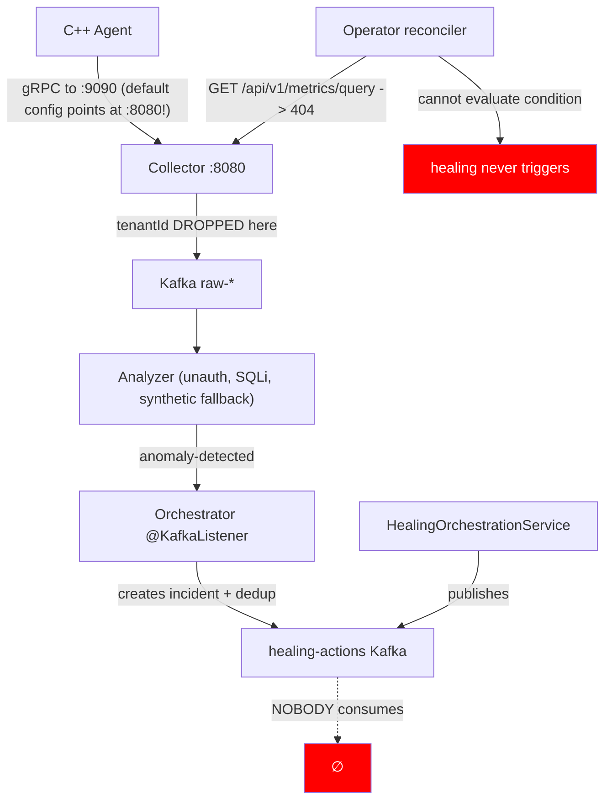
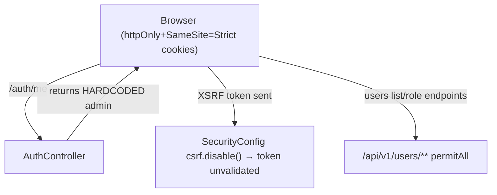

# AstraWatch — Deep Codebase Audit (v2 · verified against current tree)

**Auditor:** Buffy · **Date:** 2026-08-01
**Method:** Every service's actual source, OpenAPI specs, infra, CI, and frontend were read and verified against the current working tree. The prior `AUDIT_REPORT.md` was treated as unverified input and re-checked line-by-line.

**Headline:** The prior `AUDIT_REPORT.md` is materially stale — at least 10 of its 🔴 CRITICALs are already fixed in the current tree. This report re-verifies everything and catalogues **new criticals the prior report missed**.

---

## Executive Summary

Overall health: **~55%** (prior report claimed 52%, but the risk profile differs).

| Area | Rating |
|---|---|
| Backend services implementation | 62% |
| Frontend implementation | 78% |
| Documentation↔code alignment | 38% |
| Security hardening | 35% |
| Test coverage | 18% |
| Production readiness | 15% |

### Top 3 critical findings (verified in current code)

1. 🔴 **Real production credentials committed to source.** `services/orchestrator/src/main/resources/application.properties` ships a Gmail app password, Google OAuth client secret, and GitHub OAuth client secret as inline fallbacks; `services/payment-service/internal/config/config.go:22` ships a real Stripe secret key.
2. 🔴 **Authentication is a facade.** `AuthController.me()` returns a hardcoded `PlatformAdmin` for every request (`AuthController.java:206-215`), so the frontend `ProtectedRoute` always passes. Combined with `SecurityConfig` permitting `/api/v1/users/**` unauthenticated, there is no real authorization.
3. 🔴 **The auto-healing loop cannot fire end-to-end.** The Operator's `HTTPMetricsClient` queries `GET /api/v1/metrics/query` on the collector (`metrics/client.go:47`) — that route does not exist (collector serves `/v1/query`, `main.go:127`). Every condition evaluation errors, so healing never triggers; the Orchestrator publishes `healing-actions` to Kafka that nobody consumes; and the Operator has **no CRD manifests anywhere** to install `AutoHealingRule`.

### Biggest gaps vs. the vision
- Multi-tenancy collapses at the data path — tenantId is never attached to Kafka messages (`collector/internal/produce/producer.go`), so the analyzer buckets everything under `"default"`.
- Payment webhook handlers parse events but **have no side effects** — subscriptions never activate features.
- `scripts/` is empty (the launch scripts referenced by commit history don't exist) and `.github/workflows/ci.yml` is a stub.

---

## PHASE 1 — Repository Structure Audit

```
SERVICE: cxx-agent         PASS        bpf/, src/, include/, test/, proto/, Dockerfile, CMakeLists
SERVICE: collector         PASS        cmd/, internal/{ingest,validate,enrich,produce,query,ratelimit,consumer,catalog}, pkg/
SERVICE: analyzer          PASS        app/{routers,core,schemas,ml,services}, training/, tests/
SERVICE: orchestrator      PASS        domain/, application/, adapter/in|out/, infrastructure/
SERVICE: operator          PARTIAL     controller/, api/v1/, metrics/ present; ⚠️ NO CRD YAML anywhere in repo
SERVICE: realtime          PASS        sockets/, kafka/, redis/, auth/
SERVICE: payment-service   PASS        cmd/server, internal/{config,handlers,stripe}
FRONTEND                   PASS        all documented routes + 12 extra, all implemented
```

Structural defects:
- 🔴 `scripts/` is empty. `run_all_services.sh` and `create_kafka_topics.sh` are referenced by commit history and docs but do not exist.
- 🟠 `infra/docker/docker-compose.yml` runs infra only (kafka, postgres, clickhouse, redis, mailhog) — no app service containers. `make dev` never starts collector/analyzer/orchestrator/realtime/frontend.
- 🟠 Helm charts are skeletal — only `templates/deployment.yaml` per chart; no Service, no ConfigMap/env wiring, no Ingress, no CRDs in the operator chart.
- 🟠 `services/payment-service/pay.log` committed; `infra/terraform/postgres.tf:7` hardcodes DB password `astrawatch`.
- 🟢 No committed 111MB binary anymore (prior report claim is fixed; `.gitignore` covers `services/collector/collector`).

---

## PHASE 2 — Line-by-Line (verified)

### 2.1 C++ Agent
| File:Line | Finding | Sev |
|---|---|---|
| `bpf/tcp_probe.bpf.c` | ✅ Real RTT latency now computed via `tcp_send_times` map (prior "latency always 0" is FIXED) | — |
| `bpf/tcp_probe.bpf.c` | ⚠️ `tcp_send_times` map never evicts unmatched sockets (cap 10240 → drops under load) | 🟡 |
| `bpf/*.bpf.c` | ✅ Each probe owns its own `BPF_MAP_TYPE_RINGBUF` (prior "broken extern ref" is FIXED) | — |
| `src/ring_buffer.cpp` | ✅ Newline escaping implemented (prior M-001 FIXED); no CRC/magic still | 🟡 |
| `src/grpc_client.cpp` | 🟠 `zstd_level` param unused — `apply_compression` hardcodes `GRPC_COMPRESS_STREAM_GZIP` | 🟡 |
| `src/grpc_client.cpp` | 🟠 `stream_backlog` pops batches before write-ack; mid-stream failure silently loses drained entries | 🟠 |
| `src/main.cpp` | 🟠 `std::cout`/`std::cerr` logging only (no structured logger) | 🟡 |
| `src/config.cpp` | 🟠 `collector_address` default `localhost:8080` is the HTTP port; gRPC server binds `GRPC_PORT` default **9090** — agent gRPC targets the wrong port by default | 🟠 |
| `CMakeLists.txt` | ✅ tests wired (agent_test + ctest), zstd/libbpf optional, gRPC/OpenSSL linked | — |

### 2.2 Go Collector
| File:Line | Finding | Sev |
|---|---|---|
| `cmd/collector/main.go:60-61` | ✅ Hardcoded JWT secret FIXED — now `os.Getenv("JWT_SECRET")` + `logger.Fatal` on empty | — |
| `cmd/collector/main.go:230-254` | ✅ Wildcard CORS FIXED — allowlist via `ALLOWED_ORIGINS` | — |
| `cmd/collector/main.go:255-296` | ✅ `/v1/query` no longer in bypass list → requires JWT (prior CRITICAL-004 FIXED) | — |
| `cmd/collector/main.go:335-432` | 🔴 Catalog endpoints are hardcoded stubs (fake services/health/scorecards) AND the entire `/api/v1/catalog` prefix is auth-bypassed — unauthenticated fake data incl. mutating `POST /services`, `PUT /:id`, scorecard | 🔴 |
| `internal/produce/producer.go` | 🔴 tenantId never attached to Kafka messages — every metric crosses to the analyzer without a tenant → multi-tenancy collapses | 🔴 |
| `internal/produce/producer.go` | 🟠 `ProduceLog`/`ProduceTrace` ignore producer errors (silent drop); `ProduceMetrics` = one `ProduceSync` round-trip per metric point | 🟠 |
| `internal/enrich/enricher.go` | ✅ Real k8s informer watch (prior "no k8s client" FIXED); ⚠️ `podCache` keyed by bare pod name → cross-namespace collisions | 🟡 |
| `internal/ingest/handler.go` | ✅ Bounded channels (10k), 429 on full, 5MB/10MB limits, gzip/zstd, Redis idempotency, parameterized queries | — |
| `internal/ingest/agent_handler.go` | 🟠 stdlib `log.Printf` mixed with zap; `HandleAgentBatch` produces synchronously per metric (blocks handler) | 🟠 |
| `cmd/collector/main.go` | 🟡 `_ = otel.Tracer(...)` — exporter never configured; tracing dead code | 🟡 |

### 2.3 Python Analyzer
| File:Line | Finding | Sev |
|---|---|---|
| `app/services/anomaly_service.py:66-67` | 🔴 **SQL injection** — `service_id`/`metric` interpolated into a ClickHouse SQL f-string (unauthenticated endpoint) | 🔴 |
| `app/services/anomaly_service.py:79-80` | 🔴 **Fabricates data** — on query failure it silently returns synthetic random series as "recent values"; root-cause/predictions run on invented metrics | 🔴 |
| `app/routers/*.py` | 🔴 All analyzer endpoints unauthenticated — detect, root-cause, predict, models/retrain (cost/DoS vector), feedback | 🔴 |
| `app/core/config.py:20` | 🔴 `JWT_SECRET` default `"dev-secret"` — and never enforced | 🔴 |
| `app/__init__.py:113-119` | 🟠 CORS `allow_origins=["*"]` + `allow_credentials=True` | 🟠 |
| `app/__init__.py:26-44` | ✅ Manual offset commit (`enable_auto_commit=False` + per-message `commit()`) — prior "auto-commit" FIXED | — |
| `app/__init__.py` | ✅ `uuid.uuid4()` event IDs — prior `hash()` bug FIXED | — |
| `app/__init__.py` | 🟠 `metrics_buffer` unbounded `defaultdict` keyed by service → one noisy service can OOM | 🟠 |
| `app/ml/ensemble.py` | ✅ IF ensemble + weighted scoring + SHAP + Granger causality; threshold configurable per service/tenant (prior hardcoded 0.5 FIXED) | — |
| `app/ml/ensemble.py` | 🟠 LSTM model now cached (prior "trains from scratch every call" FIXED) but fine-tunes 1 epoch per predict request; lazy TensorFlow import per call | 🟠 |
| `app/core/kafka_client.py` | 🟠 `producer.send()` is fire-and-forget (no flush/ack) → anomaly events lost if Kafka is down | 🟠 |

### 2.4 Java Orchestrator
| File:Line | Finding | Sev |
|---|---|---|
| `application.properties` | 🔴🔴 Real credentials in source: Gmail app password (`spring.mail.password`), Google OAuth `client-secret`, GitHub OAuth `client-secret` | 🔴 |
| `adapter/in/web/AuthController.java:206-215` | 🔴 `/auth/me` returns hardcoded admin — auth gate is fake; ProtectedRoute always passes | 🔴 |
| `infrastructure/security/SecurityConfig.java:29` | 🔴 `/api/v1/users/**` is `permitAll` — user list, role updates, status toggles public | 🔴 |
| `AuthController.java:245-283` | 🔴 MFA is fictional — static TOTP secret, static backup codes, verify always "enabled" | 🔴 |
| `adapter/in/event/AnomalyEventConsumer.java` | 🟠 Auto-creates GitHub PRs from a hardcoded fake code patch (fabricated diff against a made-up file) | 🟠 |
| `application/service/NotificationService.java` | ✅ Email fully implemented — JavaMailSender, Thymeleaf templates (files exist), 3-attempt retry + backoff, HMAC unsubscribe. Prior CRITICAL-010 FIXED | — |
| `AnomalyEventConsumer.java` | ✅ Redis + DB dedup and `parseOrFallbackUUID` — prior CRITICAL-011 FIXED | — |
| `HealingOrchestrationService.java` | ✅ Healing now over Kafka `healing-actions` (prior "HTTP to nonexistent operator" FIXED) — but nothing consumes that topic; actions sit in EXECUTING forever | 🟠 |
| `application.properties` | 🟠 `ddl-auto=update` alongside Flyway (drift risk); `/actuator/**` permitAll with `show-details=always` | 🟠 |
| `pom.xml` | ✅ Temporal + Spring Statemachine deps now present (prior FIXED); verify wiring | 🟡 |

### 2.5 Go Operator
| File:Line | Finding | Sev |
|---|---|---|
| `cmd/manager/main.go` | ✅ Leader election configured (prior CRITICAL-010 FIXED) | — |
| `main.go` | ✅ `--dry-run` flag + `astrawatch.io/dry-run` annotation (prior FIXED) | — |
| `controller.go` | ✅ Namespace protection (kube-system etc.), restart-loop guard (>10), 3× scale guard, max 50 | — |
| `internal/metrics/client.go:47` | 🔴 Queries `/api/v1/metrics/query` — route does not exist on collector → condition evaluation always errors → auto-healing never triggers | 🔴 |
| `controller.go` | 🟠 Blast-radius still label/annotation-based (spoofable by cluster writers); no Postgres audit-log write (zap [AUDIT] lines + K8s events only) | 🟠 |
| repo | 🔴 No CRD YAML anywhere — `AutoHealingRule` cannot be installed | 🔴 |
| `controller.go` | 🟠 `Owns(Pod)` only — rollout/scale paths won't react to deployment changes | 🟡 |

### 2.6 Node Realtime
| File:Line | Finding | Sev |
|---|---|---|
| `src/index.js` | ✅ Cross-tenant `dashboard:all` broadcast FIXED — emits only to `tenant:${tenantId}:dashboard`; replay checks tenant (prior CRITICAL-009 FIXED) | — |
| `src/auth/socketAuth.js:58-67` | 🔴 `validateApiKey` accepts ANY 16+ char string as a valid API key (falls back to tenant `default`) — anyone joins the default room | 🔴 |
| `src/auth/socketAuth.js`, `src/config.js` | 🟠 `JWT_SECRET` defaults to `'dev-secret'`; no JWT_SECRET set in compose/helm | 🟠 |
| `src/index.js` | ✅ Per-socket rate limit (120/min) — prior FIXED | — |
| `src/index.js` | 🟡 `EVENT_CACHE_TTL_MS` config never referenced (dedup relies on size-capped cache only) | 🟡 |

### 2.7 Payment Service
| File:Line | Finding | Sev |
|---|---|---|
| `cmd/server/main.go` | ✅ JWT middleware on all billing routes (prior "no auth" FIXED); webhook + health public (correct) | — |
| `internal/handlers/billing.go` | ✅ Webhook requires `Stripe-Signature`, verifies via `ConstructEvent`, 500s if secret unset (prior bypass FIXED) | — |
| `internal/config/config.go:21-24` | 🔴 Real Stripe `sk_test_...` key hardcoded as fallback | 🔴 |
| `billing.go` | 🟠 Webhook handlers parse and log only — zero side effects. Subscriptions never activate features | 🟠 |
| `main.go` | ✅ Graceful shutdown present (prior FIXED) | — |
| — | 🟠 No usage metering / feature-gate API | 🟠 |

### 2.8 React Frontend
| File:Line | Finding | Sev |
|---|---|---|
| `hooks/useAuth.ts`, `lib/api.ts` | ✅ JWT moved from localStorage to httpOnly+Secure+SameSite=Strict cookies (prior CRITICAL-001/002 FIXED); axios withCredentials, XSRF header, 401→refresh interceptor | — |
| `App.tsx:47-56` | 🔴 `ProtectedRoute` calls `/auth/me` → returns hardcoded admin → auth gate passes for everyone | 🔴 |
| `App.tsx` | ✅ All routes implemented; heavy pages lazy-loaded | — |
| `hooks/useWebSocket.ts` | 🟠 Gateway requires handshake token; nothing visibly calls `wsManager.connect(token)` — realtime features likely never connect | 🟠 |
| `app/Layout.tsx` | ✅ Design language consistent (neutral-800 + blue glow) | — |
| `vite.config.ts` | 🟠 Proxy targets (orchestrator 8082, realtime 8084, analyzer 8000, payment 8085) match code but conflict with OpenAPI servers block (8081/3001) | 🟡 |
| `package.json` | 🟠 `npm test` = `tsc --noEmit` — zero real frontend tests | 🟠 |
| Landing | ✅ Features grid, marquee testimonials, pricing, FAQ render cleanly (verified live, zero console errors) | — |
| Landing | 🟡 Marketing numbers inconsistent (hero "1.4s MTTR" vs PRODUCT.md 3s) | 🟢 |

---

## PHASE 3 — Documentation Cross-Validation

| TDD § | Claim | Status | Gap |
|---|---|---|---|
| §3.1 | mTLS from Vault PKI | ⚠️ | File-based certs only; Vault absent |
| §3.1 | RINGBUF, 500ms batch, backoff+jitter, oldest-drop | ✅ | Verified |
| §3.2 | Idempotency via Redis | ✅ | SETNX verified |
| §3.2 | K8s label enrichment | ✅ | Informer watch present |
| §3.3 | Manual Kafka offset commit | ✅ | Fixed |
| §3.3 | LSTM autoencoder heavy path | ⚠️ | Cached but fine-tunes per call |
| §3.4 | Email notifications end-to-end | ✅ | Real (templates + retry + unsubscribe) |
| §3.4 | Spring Statemachine / Temporal | ⚠️ | Deps in pom; wiring partial |
| §3.5 | Tenant-scoped WS rooms | ✅ | Fixed |
| §3.7 | Operator delegates to Orchestrator | 🚫 | Operator executes directly; two disconnected healing paths |
| §3.7 | Leader election / dry-run | ✅ | Both fixed |
| §3.8 | Stripe webhook verification | ✅ | Fixed |
| §3.8 | Subscription lifecycle side-effects | ❌ | Webhooks log only |
| §2.8 | JWT secure storage | ✅ | Cookies now |

## PHASE 4 — OpenAPI Contract Audit
- ✅ `docs/openapi/{collector,analyzer,orchestrator,operator,realtime}.json` + `swagger.html` exist.
- 🟠 Spec server ports wrong (orchestrator :8081, realtime :3001) vs actual (8082, 8084).
- 🟠 Spec documents `POST /v1/ingest/logs`; code registers `/v1/ingest/logs/stream` (integration test curls the spec path → 404).
- 🟠 Spec service-catalog at `/v1/services`; code serves `/api/v1/catalog/...` with fake data.
- 🟠 Spec marks ingest "Unauthenticated" but code requires a JWT with `tenantId` claim — spec misleads; agent unauthenticated push path is dead.

## PHASE 5 — Security Checklist

| Check | Status |
|---|---|
| Service-to-service auth | ⚠️ mTLS only in agent (file-based); orchestrator→collector and operator→collector unauthenticated |
| Hardcoded secrets | 🔴 FAIL — Gmail app password, Google/GitHub OAuth secrets, Stripe key in source |
| `.env` committed | ✅ none tracked |
| Broken object-level authz | 🔴 `/users/**` public; `/auth/me` mock |
| tenant_id scoping | 🔴 dropped at collector→Kafka; analyzer buckets all to `"default"`; WS rooms keyed on `value.tenantId || 'default'` |
| SQL injection | 🔴 analyzer f-string (`anomaly_service.py:66`) |
| Blast-radius server-side | 🟠 guard present in operator but bypassable; no Orchestrator-side enforcement; no audit-log DB writes |
| Webhook signature | ✅ fixed |
| PCI (raw card data) | ✅ Stripe handles cards |

## PHASE 6 — Flow Diagrams (current state)





## PHASE 7 — System Design Scorecard

| Dimension | Score | Key issue |
|---|---|---|
| Scalability | 🟡 55% | Collector stateless ✅; analyzer unbounded buffer, per-call TF fine-tune ❌ |
| Reliability | 🟡 45% | No DLQ, no circuit breakers wired, healing loop dead |
| Data isolation | 🔴 15% | tenantId dropped at Kafka; shared "default" everywhere |
| Security | 🟡 40% | Secrets in source; fake auth; open /users |
| Meta-observability | 🟡 50% | /metrics + actuator exist; OTel unexported; no tracing |
| Tests | 🔴 18% | Few unit tests; integration script hits all-wrong ports; CI is echo |
| Docs alignment | 🟡 38% | Ports, endpoint paths, auth claims drift |
| Production readiness | 🔴 15% | No CRDs, no app containers in compose, no JWT_SECRET wired, empty scripts |

## PHASE 8 — Corrective Plan (critical path)

**Immediate (this week):**
1. **Rotate + remove secrets** — strip Gmail/OAuth/Stripe fallbacks from `application.properties` + `config.go`; fail fast when env vars are empty.
2. **Fix `AuthController.me()`** to resolve the real principal from the JWT (or 401); lock `/api/v1/users/**` to authenticated roles.
3. **Repair the healing data path** — (a) operator `metrics/client.go` → hit collector's real `/v1/query`; (b) consume `healing-actions` in the operator (or write intent to a CR/annotation); (c) commit `AutoHealingRule` CRD YAML under `infra/`.
4. **Propagate tenantId** through `producer.go` → analyzer events → realtime rooms.

**Next 2 weeks:** parameterize analyzer ClickHouse queries (kill SQLi) and remove synthetic fallback; implement webhook side-effects (plan mutation + feature-gate API); add CRD manifests + app services to compose; rewrite `integration_test.sh` against real ports; make CI actually build/test.

---

## Appendix — "Already Fixed Since AUDIT_REPORT.md" (verified)

| Prior ID | Claim | Current status |
|---|---|---|
| C-001/C-002 | JWT in localStorage | ✅ httpOnly+Secure+SameSite=Strict cookies (`AuthController`), XSRF header, refresh flow |
| C-003 | Collector hardcoded JWT secret | ✅ `os.Getenv` + fatal-if-empty |
| C-004 | `/v1/query` unauthenticated | ✅ requires JWT now |
| C-005/C-006/C-007 | Payment no auth / empty webhooks / bypass | ✅ JWT middleware, ConstructEvent verified, 500 if secret unset (handlers still side-effect-free) |
| C-008/C-009 | Healing HTTP to nonexistent operator | ✅ now Kafka `healing-actions` (nobody consumes it) |
| C-010 | Email system missing | ✅ JavaMailSender + Thymeleaf templates + retry + unsubscribe |
| C-011 | UUID.fromString on hash eventId | ✅ `parseOrFallbackUUID` |
| C-012/C-013 | Operator bypasses approval / label blast-radius | ⚠️ still executes directly; blast-radius improved (namespaces, restart loops, scale guards) |
| C-014 | Cross-tenant WS broadcast | ✅ tenant-scoped rooms + replay tenant check |
| H-001/H-002 | tcp_probe extern / latency 0 | ✅ per-probe ringbuf maps; real RTT measured |
| M-001 | Newline injection in ring buffer | ✅ escaping added |
| M-003 | hash() eventId | ✅ uuid4 |
| L-002 | 111MB binary committed | ✅ removed + gitignored |
