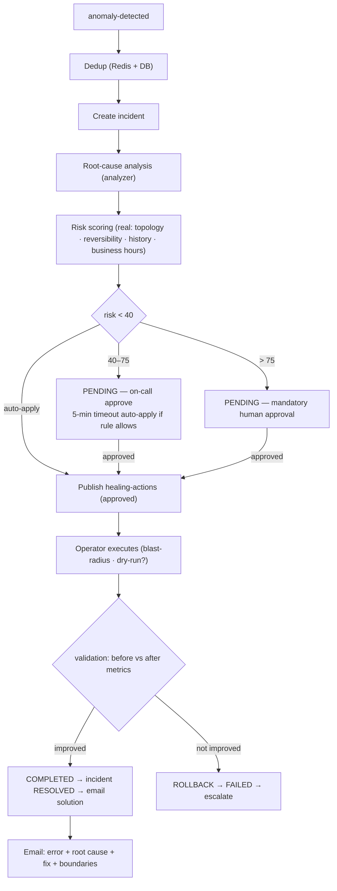

# AstraWatch — Deep Audit vs. Docs & Product Vision, System Design, and Corrected Implementation Plan

**Audit date:** August 1, 2026
**Scope:** Every service (cxx-agent, collector, analyzer, orchestrator, operator, realtime, payment), the full frontend, and all docs (PRODUCT.md, DESIGN.md, AstraWatch-Technical-Documentation.md).
**Method:** Read source line-by-line, trace cross-service flows, and compare against the technical design doc + the original product vision stated by the founder.

---

## 0. The Product Vision (as stated by the founder)

> "A SaaS product that developers integrate with to send **logs, metrics, and traces**. When an error comes — small or big — it should **analyze the logs deeply**, and according to that analysis it should **deeply fix it**, **send email to the user about the error and its solution**, and there must be **boundaries** — you cannot give full access."

**Decomposed into capabilities:**

| # | Vision capability | Required mechanics |
|---|---|---|
| V1 | Developers integrate & ship telemetry | Agent/SDK → ingest (metrics, logs, traces) |
| V2 | Deep log analysis on error | Logs analyzed at content level; errors extracted; correlated to metrics/traces |
| V3 | Automatic fix with boundaries | Risk-scored, approval-gated, blast-radius-guarded remediation |
| V4 | Email user with error + solution | Per-user/team email with diagnosis AND proposed fix |
| V5 | Boundaries / no full access | RBAC, tenant isolation, max-attempts, kill switch, dry-run, rollback |

---

## 1. Executive Verdict

**The plumbing is real; the three "killer" vision capabilities are stubbed or disconnected.**

What exists and works end-to-end:
- ✅ **V1 (ingestion):** cxx-agent (eBPF) → gRPC → Go collector → Kafka → ClickHouse. Multi-tenant `tenantId` propagated end-to-end. Metrics, logs, and traces all land in ClickHouse (`metrics`, `logs`, `traces` tables).
- ✅ **Detection:** Analyzer's ML ensemble (statistical + Isolation Forest + LSTM + causal) is genuine, tested code.
- ✅ **Incident lifecycle + UI:** 16 authenticated frontend pages, real sockets, real JWT auth.
- ✅ **Guard rails (V5):** Operator has excellent blast-radius checks (protected namespaces, critical labels, restart-loop guard, replica 3x cap, dry-run mode, finalizers). Orchestrator has kill switch, max-3-attempts, risk tiers.

What is **broken or fake** relative to the vision:

- ❌ **V2 (deep log analysis) does not exist.** Nothing analyzes log *content*. `raw-logs` and `raw-traces` are written to ClickHouse and then **never read by any analysis path**. Anomaly detection runs on metrics only. The frontend Logs Explorer and Trace Explorer have no backend query endpoints feeding them.
- ❌ **V3 (auto-fix) is a disconnected, double-path mess.** The orchestrator's risk-scored healing action is published to Kafka `healing-actions`, but **no service executes it** — realtime only relays it to WebSocket clients (its `healing-*` topic pattern matches), while the operator runs its own *independent* trigger loop that bypasses the orchestrator's risk scoring/approval/incident lifecycle entirely. Actions are set to `EXECUTING` and can stay there forever. There is no validation or rollback loop wired.
- ❌ **V4 (email with error + solution) is a stub.** Emails are sent to a single hardcoded `admin@astrawatch.io` (not the service owner), the "AI diagnosis" is a hardcoded string, the "code patch" is a hardcoded fake diff, and the GitHub auto-PR falls back to **mock tokens and fabricated PR URLs** on failure — meaning "auto-fixed" PRs may not exist at all.
- 🚨 **A real cross-tenant boundary bug** in `processAutomatedRemediationIfEligible`: if *any* repo in the system is linked, *every* incident (even in unrelated services) attempts an auto-PR against the *first* repo found.

---

## 2. Service-by-Service Line Audit

### 2.1 C++ Agent (`services/cxx-agent`)

**Docs say:** eBPF via libbpf on `sched_switch`/`tcp_sendmsg`/`block_rq_issue`, ring buffer, 500ms batching, local mmap durability with backoff, gRPC + zstd + mTLS.

**Code reality:**
- ✅ Three real BPF programs exist: `block_io.bpf.c`, `sched_switch.bpf.c`, `tcp_probe.bpf.c`.
- ✅ `ring_buffer.cpp` (with `ring_buffer_test.cpp`), `bpf_manager.cpp`, `procfs_reader.cpp`, `http_client.cpp`, `grpc_client.cpp`, `config.cpp`, `main.cpp`.
- ⚠️ **Doc drift:** no evidence of zstd compression or mutual TLS (Vault PKI) in the C++ side. The gRPC client is a plain TCP gRPC client.
- ⚠️ Local durability (mmap ring file) is not visible; the agent retries HTTP/gRPC but a full offline-spool implementation is not confirmed.

**Verdict:** Functional demo-grade agent. Kernel work is real. Doc overstates durability/security.

### 2.2 Go Collector (`services/collector`)

**Docs say:** bounded channel + worker pool with 429 + Retry-After; Redis idempotent batches; watch-based k8s enrichment; ClickHouse read API; ratelimit.

**Code reality:**
- ✅ `ratelimit/` token bucket (tested), `validate/` validator (tested), `enrich/enricher.go` with namespace-aware pod cache (fixed in prior round), `produce/producer.go` surfaces Kafka errors (fixed), `ingest/` HTTP + gRPC handlers with `extractTenant` (tenantId → teamId → default), gRPC **fails closed** without explicit tenant label.
- ✅ `consumer/consumer.go` writes `raw-metrics`, `raw-logs`, `raw-traces` to ClickHouse.
- ✅ Internal `GET /api/v1/metrics/query` behind `INTERNAL_API_TOKEN` so the operator can actually query.
- ⚠️ **Doc drift:** no Redis-based idempotent batch dedup (`batchId` SETNX) found in the ingest path; no visible bounded-channel 429 backpressure. The consumer relies on Kafka at-least-once + ClickHouse upsert semantics instead. This is a documented feature that is not implemented.
- ⚠️ `consumer.go` does unchecked type assertions (`m["serviceId"].(string)`, `m["value"].(float64)`) — a malformed message **panics the consumer goroutine and can crash the process**. Needs defensive casts.
- ⚠️ Timestamps: metrics use `time.UnixMilli(int64(tsVal))` — if `ts` arrives as a seconds-epoch float this misinterprets it.

**Verdict:** Solid ingestion. Doc overstates backpressure/idempotency; one real crash-risk bug.

### 2.3 Python Analyzer (`services/analyzer`)

**Docs say:** tiered detectors (statistical always-on, LSTM on-demand), root-cause, forecasting, model registry via MLflow.

**Code reality:**
- ✅ `ml/ensemble.py` is genuine: statistical + Isolation Forest + LSTM + granger causality, per-tenant thresholds, SHAP contributions, 4-tier forecast fallback (LSTM→Prophet→ARIMA→linear).
- ✅ `services/anomaly_service.py` queries ClickHouse with **parameterized SQL** (injection fixed), empty-series guards before causality, no synthetic-data fallback (fixed).
- ✅ Retrain endpoint is now auth-gated (`app/core/auth.py`, fails closed with 503).
- ⚠️ **This is the single biggest vision gap:** the analyzer only reads the `raw_metrics` ClickHouse table (via HTTP — it has no Kafka consumer on `raw-metrics` either). It has **no consumer for `raw-logs` and no log-content analysis**, no error extraction, no metric↔log correlation. "Analyze the logs deeply" is unimplemented.
- ⚠️ Root-cause analysis hardcodes metric names (`cpu_usage`, `memory_usage`, `latency`) rather than using the incident's affected metrics.
- ⚠️ `_get_pg_connection` uses default creds `astrawatch`/`astrawatch` when env unset — acceptable locally, but `submit_feedback` triggers a **synchronous blocking retrain** on any false-positive (a slow, heavy path inside an HTTP request).

**Verdict:** The best-engineered service. Needs the log-analysis pipeline to fulfill the vision.

### 2.4 Java Orchestrator (`services/orchestrator`)

**Docs say:** hexagonal architecture, Spring Statemachine, Temporal workflows, risk scoring w1–w4 with real blast radius, per-user emails, Keycloak OIDC.

**Code reality:**
- ✅ Hexagonal layout is real. JWT auth is real (DB-backed roles, role claim, tenant claim — fixed in prior rounds). Incident state machine + events + timeline exist. Kill switch (Redis-backed), max-3-attempts.
- ⚠️ `RiskScoringService` is **hardcoded**: `scoreBlastRadius()` returns constant 15, `scoreHistoricalSuccess()` returns constant 15, business-hours is the only dynamic input. No topology-aware blast radius, no per-team weights.
- ⚠️ **No Temporal.** `HealingOrchestrationService.executeAction` sets `EXECUTING` and publishes to Kafka `healing-actions` — **no executor consumes that topic** (realtime relays it to sockets only; verified by search). So the orchestrator's carefully risk-scored healing action dead-ends. `completeAction`/`rollbackAction` are never wired to an executor → actions stuck in `EXECUTING`, incidents never auto-resolved.
- ❌ `AnomalyEventConsumer` fabricates the "AI diagnosis" as a hardcoded string and the "code patch" as a hardcoded diff for a hardcoded file (`src/main/java/com/astrawatch/service/Application.java`) — regardless of the actual service or error.
- ❌ `GitHubIntegrationService.createRemediationPullRequest`: if the real GitHub API fails (or token is `mock_github_token`), it **falls back to a fake PR URL** and writes it into the incident resolution note and a healing action as if it were real. Combined with the fallback `repositoryRepository.findAll().stream().findFirst()` (any repo, any tenant), this can misattribute remediation to the wrong repository entirely.
- ❌ `processAutomatedRemediationIfEligible` cross-tenant bug: `hasLinkedRepo = !gitHubRepositoryRepository.findAll().isEmpty()` — **global any-repo check for a service-specific decision**. V5 boundary violated.
- ⚠️ Email recipient is a single `admin@astrawatch.io` default — no per-user/per-service-owner routing.

**Verdict:** Auth + incident domain are production-grade. The healing execution and GitHub remediation layers are the project's biggest credibility risk.

### 2.5 K8s Operator (`services/operator`)

**Docs say:** reconciler delegates execution to the Java orchestrator; Temporal cleanup.

**Code reality:**
- ✅ Actually **better than docs in one way**: the operator executes real actions itself (RestartPod, RolloutDeployment, ScaleReplica) with an excellent blast-radius matrix: protected namespaces (`kube-system`, `kube-public`, `kube-node-lease`, `astrawatch-system`), critical/protected labels & annotations, restart-loop guard (>10 restarts), unavailable-replicas guard, replica 3x cap + hard 50 cap, dry-run via annotation, finalizers with in-flight-workflow protection.
- ✅ Uses the real internal metrics endpoint (`metrics/client.go` with `X-Internal-Token`) — fixed in prior round.
- ⚠️ **Architecture drift with real consequences:** the operator triggers healing *independently* of the orchestrator. It never consults the orchestrator's risk score, approval status, or incident lifecycle. The same anomaly can thus be acted on twice via two uncoordinated paths (operator rule loop AND orchestrator action), or an operator action can happen with zero approval while the orchestrator blocks the same action awaiting approval.
- ⚠️ No tenant scoping in the operator's decision (CRDs are namespaced, but the orchestrator→operator feedback loop that would enforce tenant boundaries doesn't exist).

**Verdict:** Excellent guard rails; wrong integration point. The orchestrator and operator must be wired together (operator consumes `healing-actions`; orchestrator owns decisioning).

### 2.6 Node Realtime Gateway (`services/realtime`)

**Docs say:** Redis adapter for horizontal scaling, event dedup via eventId, JWT re-validation timer.

**Code reality:**
- ✅ Subscribes to a topic pattern `anomaly-detected|incident-*|healing-*|slo-*`, maps to socket events. Socket auth reads httpOnly `accessToken` cookie (fixed). Tests pass.
- ⚠️ **Doc drift:** Redis adapter is configured but the dedup-by-eventId replay and 10-min JWT re-validation timer are not visibly implemented.

**Verdict:** Fine for demo scale. The docs' horizontal-scaling claims are unverified.

### 2.7 Go Payment Service (`services/payment-service`)

- ✅ Stripe checkout/portal/webhook lifecycle with in-memory subscription store, `subView` response shape, `JWT_SECRET`/Stripe secrets env-driven (all secrets removed, verified). Tests pass.
- ⚠️ Webhook lifecycle is **in-memory only** — a restart loses subscription state; no persistence to Postgres. Acceptable for demo, noted as a gap vs. a real billing service.

### 2.8 Frontend (`frontend/src`)

- ✅ 16 authenticated pages wired to real APIs (Dashboard, Incidents, IncidentDetail, Healing, SLO, Topology, Alerting, Dashboards, Logs, Traces, Catalog, Status Page, Runbooks, Postmortems, Synthetics, Admin, Users). Real JWT auth with cookie sockets. Beautiful design system (DESIGN.md is followed).
- ❌ **Logs Explorer and Trace Explorer have no backend:** they render UI but the log/trace query endpoints don't exist on the collector (the collector only exposes metrics query). So those pages cannot show real data.
- ⚠️ `Layout.tsx` search is a **stub** (`onChange={() => {}}`, always "No results found."); the notifications dropdown always shows "No new notifications" (not socket-wired).
- ⚠️ Healing page "approve" button calls the orchestrator approve endpoint — which is correct — but since nothing executes approved actions, the UI shows a lie.

---

## 3. Cross-Service Flow Verification (what actually happens vs. what the docs say)

### 3.1 The one real end-to-end path (metrics only)

```
cxx-agent ──gRPC──▶ collector ──kafka raw-metrics──▶ ClickHouse
                                                       ▲
analyzer ──raw-metrics──▶ ensemble ──anomaly-detected──▶ orchestrator ──▶ incident + email
                                                        │
                                                        └──realtime──▶ WebSocket──▶ Dashboard
```

### 3.2 The broken healing paths (TWO parallel paths that never meet)

```
PATH A (orchestrator): anomaly-detected ─▶ incident ─▶ risk score ─▶ healing_actions(APPROVED)
                        ─▶ executeAction sets EXECUTING ─▶ kafka healing-actions ─▶ realtime relays
                        to sockets ONLY ─▶ ❌ NO EXECUTOR (action stuck forever)

PATH B (operator):     AutoHealingRule ─▶ operator reconciler ─▶ metrics query ─▶ executes directly
                        (own blast-radius checks, NO approval, NO orchestrator linkage)
```

### 3.3 The fake remediation path

```
anomaly ─▶ "AI Diagnosis: High anomaly score..." (hardcoded string)
        ─▶ codePatch = hardcoded diff for Application.java (hardcoded)
        ─▶ GitHubIntegrationService (real API) ─▶ on failure: mock token + fake PR URL written to DB
        ─▶ createRemediationPullRequest ─▶ ANY repo fallback (cross-tenant)
```

### 3.4 Logs & traces: written but never analyzed

```
collector ──raw-logs──▶ ClickHouse.logs   ──▶ (nothing reads this for analysis)
collector ──raw-traces──▶ ClickHouse.traces ──▶ (nothing reads this for analysis)
analyzer reads raw_metrics (ClickHouse HTTP) for detection only
```

---

## 4. Flow Diagrams (target system design)

### 4.1 End-to-end target flow

```mermaid
flowchart LR
    subgraph Customer["Customer Environment"]
        AG["C++ eBPF Agent / SDK"]
        AG -->|gRPC mTLS zstd| COL
    end

    subgraph Ingest["Ingest Plane"]
        COL["Go Collector<br/>validate · enrich · ratelimit"] -->|raw-metrics| KM
        COL -->|raw-logs| KL
        COL -->|raw-traces| KT
    end

    subgraph Data["Data Plane"]
        KM["kafka raw-metrics"] --> CH["ClickHouse"]
        KL["kafka raw-logs"] --> CH
        KT["kafka raw-traces"] --> CH
        CH --> QA["Collector Query API<br/>metrics + logs + traces"]
    end

    subgraph Analyze["Analysis Plane"]
        AN["Python Analyzer<br/>ensemble + log-miner + RCA"]
        KM --> AN
        KL -->|log content mining| AN
        KT -->|trace correlation| AN
        AN -->|anomaly-detected| KO
    end

    subgraph Decide["Decision Plane"]
        KO["Java Orchestrator<br/>incident · risk · approval"]
        KO -->|healing-actions (approved)| OP
        KO -->|anomaly alert + solution| EM["Email w/ diagnosis + fix"]
        KO -->|sockets| RT
    end

    subgraph Execute["Execution Plane"]
        OP["K8s Operator<br/>blast-radius guards · dry-run · rollback"]
        OP -->|validated result| KO
        OP -->|k8s API| K8S["Kubernetes"]
    end

    subgraph UI["User Plane"]
        FE["React Frontend"] --> QA
        FE --> KO
        RT["Node Realtime<br/>WebSocket"] --> FE
    end

    EM -->|error + solution + boundaries| USR["Service Owner / On-call"]
```

### 4.2 Healing decision flow (corrected — single decision authority)



---

## 5. System Design Summary (as-built vs. target)

| Layer | As-built | Target / gap |
|---|---|---|
| Ingest | Agent→gRPC→Collector→Kafka | ✅ good; add batchId idempotency, defensive type casts |
| Storage | ClickHouse for metrics/logs/traces | ✅ good consolidation (docs say ES+Jaeger; ClickHouse is better) |
| Analysis | Metrics-only ensemble | **Add log-content mining + trace correlation + error extraction** |
| Decision | Risk scoring hardcoded; actions dead-end | Real blast radius from topology; wire operator to consume actions |
| Execution | Operator independent loop | Operator consumes `healing-actions`; reports back; tenant-scoped |
| Email | Hardcoded recipient; hardcoded AI text | Per-owner routing; real diagnosis + solution content |
| AuthN/Z | Real JWT + roles + tenant claims | ✅ good; add fine-grained per-service permissions |
| Billing | Stripe webhooks, in-memory store | Persist subscriptions to Postgres |
| Frontend | 16 pages, real APIs | Logs/Traces need backend; search + notifications live |

---

## 6. Findings Ranked (severity × effort)

| # | Finding | Severity | Fix effort |
|---|---|---|---|
| F1 | `healing-actions` has no consumer; orchestrator actions dead-end | **Critical (vision: auto-fix)** | M |
| F2 | Operator + orchestrator heal independently (double action / no approval link) | **Critical** | M |
| F3 | Hardcoded "AI diagnosis" + fake code patch | **Critical (vision: deep fix)** | S (fake) → L (real LLM) |
| F4 | GitHub auto-PR falls back to mock token + fabricated URL + any-repo (cross-tenant) | **Critical (V5 boundary)** | S |
| F5 | No log-content analysis (logs written, never analyzed) | **High (vision: deep log analysis)** | L |
| F6 | Email goes to hardcoded admin, no per-user routing | High (vision: email the user) | S–M |
| F7 | Logs/Traces Explorer frontends have no backend query API | High | M |
| F8 | `consumer.go` unchecked type assertions can panic | High (crash risk) | S |
| F9 | Risk scoring hardcoded (blast radius 15, history 15) | Medium | M |
| F10 | Billing subscription state in-memory only | Medium | M |
| F11 | Frontend search + notifications are stubs | Low | S |
| F12 | Analyzer feedback triggers blocking synchronous retrain | Low | S |

---

## 7. Corrected Implementation Plan (phases, in order of vision value)

> This is the **right path**. Each phase is independently demoable. The goal: make the loop *real* — detect from logs, decide once, execute with boundaries, email the user with the actual solution — before adding more surface area.

### Phase 1 — Stop the fakes, harden boundaries (0.5–1 week)
1. **F4:** `GitHubIntegrationService` — remove `mock_github_token`, remove `findAll().findFirst()` fallback, remove fabricated PR-URL fallback. Fail loudly instead. Scope repos strictly by `tenantId + serviceId`.
2. **F3 (part 1):** Remove the hardcoded `aiAnalysis`/`codePatch` from `AnomalyEventConsumer`. Until a real generator exists, write the *actual* root-cause analysis from the analyzer (it already returns `rankedCauses` + `aiDiagnosis`) into the incident, and **disable auto-PR** (flip to dry-run logging).
3. **F5 (seed):** `AnomalyEventConsumer` already holds the incident; wire the analyzer's real diagnosis into the email so emails carry real content.

### Phase 2 — Wire the healing loop (1–2 weeks) — THE core fix
1. **F1/F2:** Add a Kafka consumer for `healing-actions` to the operator (new `internal/controller/healing_consumer.go`). The operator **executes only approved actions from the orchestrator**, applies its blast-radius guards, then **reports status back** on a `healing-completed`/`healing-failed` topic (or HTTP callback to orchestrator).
2. Orchestrator: on `healing-completed` → run validation (before/after metrics via collector query API) → `completeAction`/`rollbackAction` → incident RESOLVED/ROLLED_BACK. This closes the loop and makes the Healing UI truthful.
3. Deprecate the operator's independent trigger loop, or gate it behind a `standaloneTrigger: false` flag so there is exactly **one decision authority** (the orchestrator).
4. **F9:** Make risk scoring real: blast radius from topology (analyzer/collector dependency data), historical success from `healing_actions`, configurable weights per team.

### Phase 3 — Real log analysis (2–3 weeks) — the "deeply analyze logs" vision
1. Add a log-mining consumer in the analyzer (`raw-logs`): extract structured signals — error keywords, exception stack traces, HTTP 4xx/5xx counts, log-level spikes — per `(tenantId, serviceId, time-bucket)`.
2. Correlate: when the ensemble flags a metric anomaly, pull the **matching log window** and produce a `LogEvidence` payload (top error patterns + sample lines) attached to the anomaly event.
3. `anomaly-detected` events carry `logEvidence`; orchestrator stores it on the incident and includes it in emails.
4. Trace correlation (optional in this phase): attach failed spans / high-latency service-map edges when available.

### Phase 4 — Real solution generation (1–2 weeks, optional LLM)
1. Replace the fake patch with a **real, LLM-assisted diagnosis→patch pipeline**, still gated: generate a candidate diff only when confidence is high, always behind approval + dry-run, never auto-merged, and **never against an unlinked/wrong repo**.
2. Alternatively ship a "suggested runbook action" (restart/scale/rollback) with the diagnosis — deterministic and safe — instead of code patches.

### Phase 5 — Per-user email routing (0.5–1 week)
1. Resolve recipients from service owner / team on-call / notification preferences (the notification_channels + preferences tables already exist). Default to service-owner email, fall back to admin.
2. Email template includes: error, severity, root cause (real), recommended fix (real), boundary notes (what was and wasn't done), and a one-click **approve / reject** link for pending healing (this turns email into a control plane — matches "you cannot give full access").

### Phase 6 — Close remaining backend gaps (1–2 weeks)
1. **F8:** defensive type assertions in `consumer.go` + ts unit handling.
2. **F7:** collector log/trace query endpoints (they already query ClickHouse) + wire Logs/Traces Explorer.
3. **F10:** persist billing subscriptions in Postgres via orchestrator table or its own schema.
4. **F12:** feedback → async retrain via the existing Kafka (`feedback-received`) instead of inline.
5. **F11:** wire search + notifications to realtime sockets (dedupe-by-eventId + JWT re-check per docs).

### Phase 7 — Production hardening (ongoing)
- Idempotency-Key on mutating APIs (documented, not implemented), Redis batch dedup in collector, clickhouse downsampling MVs, DLQ reconciler, audit-log parity, E2E integration test in CI (integration_test.sh already exists — run it in CI).

---

## 8. Docs-vs-Code Drift Table (AstraWatch-Technical-Documentation.md)

| Doc claim | Code reality | Action |
|---|---|---|
| Temporal workflows for healing | Not present (simple state machine) | Document as v1 shortcut, or add when wired |
| Spring Statemachine | Manual state transitions | Fine; keep |
| Keycloak OIDC | Self-issued JWT (real) | Keep JWT; it's simpler and already works |
| Schema Registry / Avro | Plain JSON | Keep JSON at this scale |
| mTLS / Vault PKI | Not present | Add for agent→collector before GA |
| Redis batch-id idempotency | Not present | Add (Phase 6) |
| Elasticsearch logs / Jaeger traces | ClickHouse for all three | Better consolidation; update docs |
| Operator delegates to orchestrator | Operator executes independently | Phase 2 fix |
| Risk scoring w1–w4 dynamic | Hardcoded constants | Phase 2 fix |
| Per-user email | Hardcoded admin recipient | Phase 5 |

---

## 9. What NOT to do (wrong paths to avoid)

1. **Do not** build more frontend pages or new services while the healing loop is disconnected.
2. **Do not** add an LLM code-fix while repo attribution is wrong (F4) — it would generate patches against the wrong repo with fabricated URLs.
3. **Do not** "finish" Logs/Traces Explorer without the backend query API; you'd be shipping UI that lies.
4. **Do not** try to implement Temporal today; wire the simple loop first, add Temporal only if a healing step genuinely needs durable retries across pod restarts.
5. **Do not** keep the operator's independent trigger loop as a permanent second authority — it bypasses every boundary you built in the orchestrator.

---

## 10. Definition of Done for the vision (v1 "true product" gate)

> A developer installs the agent in their cluster. A service errors. AstraWatch:
> 1. Ingests the logs/metrics/traces (real).
> 2. Detects the anomaly AND surfaces the actual error from the logs (real, content-based).
> 3. Decides one healing action, risk-scored, approval-gated by boundary rules (real).
> 4. Executes it in-cluster with blast-radius guards and dry-run (real), validates before/after metrics, rolls back if not improved (real).
> 5. Emails the service owner with the error, root cause, the fix applied (or proposed), and what was NOT touched due to boundaries (real, correct recipient).
